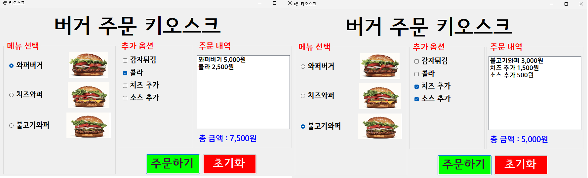
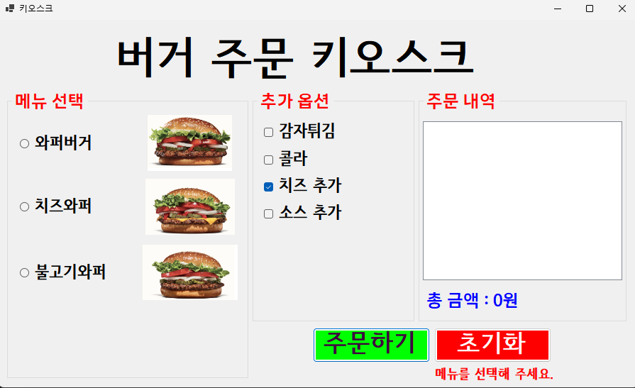

# (C# 코딩) 키오스크 시스템
## 개요
- C# 프로그래밍 학습
- 1줄 소개: 햄버거 주문 (부가적으로 사이드메뉴 주문) 시스템을 시중의 키오스크처럼 구현해봄
- 사용한 플랫폼:
  - C#, .NET Windows Forms, Visual Studio, GitHub
- 사용한 컨트롤:
  - Label, TextBox, Button
- 사용한 기술과 구현한 기능:
  - Visual Studio를 이용하여 UI 디자인
  - if문을 이용한 메뉴 가격 책정

## 실행 화면 (과제1)
- 과제1 코드의 실행 스크린샷

- 과제 내용
  - 기본 UI 디자인
  - 버거 이미지 추가
  - 주문/초기화 버튼 구현
  - 주문 내역 리스트박스 구현
- 구현 내용과 기능 설명
  - if문으로 Checkbox, Radio 버튼을 감지하여 선택된 것이 있을 때 listbox에 메뉴명, 가격을 추가하고 totalcost를 추가함
  - listbox 아래 라벨에서 totalcost의 합계를 보여줌
  - Groupbox 안의 버거 메뉴에서는 Radio 버튼이 1개씩만 선택이 가능함
  - 체크박스는 여러 개 선택 가능
  - 초기화 버튼을 클릭하면 checkbox, 라디오 버튼 선택을 모두 강제로 해제하고 totalcost를 0으로 설정함

- ## 실행 화면 (과제2)
- 과제2 코드의 실행 스크린샷

- 과제 내용
  - 본메뉴 미선택시 메뉴 선택하라는 알림과 함께 계산 X
- 구현 내용과 기능 설명
  - If 문을 사용하여 Radio 선택을 !&&으로 감지하여 아무것도 선택되지 않았을때 에러텍스트를 공백에서 주문불가 사유로 바꾸고 return하여 주문을 막음

- ## 실행 화면 (과제3)
- 과제3 코드의 실행 스크린샷

- 과제 내용

- 구현 내용과 기능 설명

- ## 실행 화면 (과제4)
- 과제4 코드의 실행 스크린샷

- 과제 내용

- 구현 내용과 기능 설명
